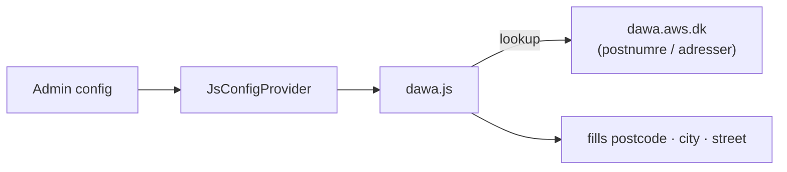

# Softcode_DawaAddress 🇩🇰

A Magento 2 module that adds **Danish address autocomplete** to the checkout using
[DAWA](https://dawa.aws.dk/) (Danmarks Adressers Web API):

- Type a **postcode** → the **city** fills in automatically
- Start typing a **street** → get a live address dropdown
- Works with a **combined** street field or **separate** street + house-number fields

It runs entirely in the browser (calls DAWA directly, no backend proxy) and stores
no personal data, so there is nothing extra to secure or GDPR-audit.

---

## Requirements

- Magento **2.4.x**
- PHP **8.1** or **8.2**
- A Danish-address checkout (the DAWA API only covers Denmark)

## Installation

**With Composer (recommended)**

```bash
composer require softcode/module-dawa-address
bin/magento setup:upgrade
bin/magento setup:di:compile
bin/magento cache:flush
```

**Manually**

Copy the module to `app/code/Softcode/DawaAddress`, then run the same three commands.

## Configuration

**Stores → Configuration → Softcode → DAWA Address**:

- **Enable** the feature
- Choose the **street mode** — one combined street field, or separate street and
  house-number fields
- Set the **CSS selectors** for your postcode, city and street inputs, so it works
  with any checkout theme or one-page checkout

---

## How it works

- `Block/Checkout/Init` + `Model/JsConfigProvider` pass the admin settings (enabled
  flag, street mode, selectors) to the frontend.
- The layout (`checkout_index_index.xml`) loads the frontend widget on the checkout.
- `web/js/dawa.js` wires up two behaviours: postcode → city lookup, and a debounced
  address autocomplete rendered by `web/js/dropdown.js`.



Only DAWA field values are written into the form inputs; nothing is sent to your
server or stored.

---

## License

MIT — see [LICENSE](LICENSE).
