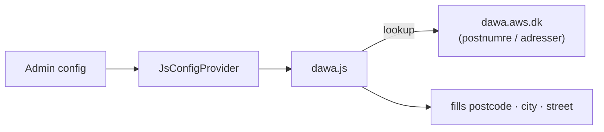

# Softcode_DawaAddress 🇩🇰

A Magento 2 module that adds **Danish address autocomplete** to the checkout using
[DAWA](https://dawa.aws.dk/) (Danmarks Adressers Web API):

- Type a **postcode** → the **city** fills in automatically
- Start typing a **street** → get a live address dropdown
- Works with a **combined** street field or **separate** street + house-number fields

It runs entirely in the browser (calls DAWA directly, no backend proxy) and stores
no personal data, so there is nothing extra to secure or GDPR-audit.

---

## Requirements

- Magento **2.4.x**
- PHP **8.1** or **8.2**
- A Danish-address checkout (the DAWA API only covers Denmark)

## Installation

**With Composer (recommended)**

```bash
composer require softcode/module-dawa-address
bin/magento setup:upgrade
bin/magento setup:di:compile
bin/magento cache:flush
```

**Manually**

Copy the module to `app/code/Softcode/DawaAddress`, then run the same three commands.

## Configuration

**Stores → Configuration → Softcode → DAWA Address**:

- **Enable** the feature
- Choose the **street mode** — one combined street field, or separate street and
  house-number fields
- Set the **CSS selectors** for your postcode, city and street inputs, so it works
  with any checkout theme or one-page checkout

---

## How it works

- `Block/Checkout/Init` + `Model/JsConfigProvider` pass the admin settings (enabled
  flag, street mode, selectors) to the frontend.
- The layout (`checkout_index_index.xml`) loads the frontend widget on the checkout.
- `web/js/dawa.js` wires up two behaviours: postcode → city lookup, and a debounced
  address autocomplete rendered by `web/js/dropdown.js`.



Only DAWA field values are written into the form inputs; nothing is sent to your
server or stored.

---

## Testing

The PHP that decides what the frontend widget receives is unit tested, and it
**runs without a Magento install** — `Test/bootstrap.php` autoloads the module and
stubs the few Magento contracts it mocks:

```bash
phpunit -c phpunit.xml.dist
```

`JsConfigProviderTest` pins the activation rules — the widget stays **disabled**
when the toggle is off *or* any CSS selector is missing (a safety guard), and the
street-mode/debounce defaults are applied. `StreetModeTest` checks the admin
dropdown offers exactly `separate` and `combined`.

The **frontend behaviour is unit tested** with Jest + jsdom (no Magento needed):

```bash
npm install
npm test
```

- `Test/js/dropdown.test.js` — mouse selection, keyboard `selectActive`, arrow-key
  highlight with clamping, and hide/replace, all through the real `dropdown.js`.
- `Test/js/dawa.test.js` — postcode → city lookup (success *and* DAWA API failure),
  debounced autocomplete, keyboard `ArrowUp`/`ArrowDown`/`Enter`/`Escape`, and that
  repeated focus does not stack duplicate handlers.

Only the full checkout wiring (real DAWA calls, theme layout) still needs a manual
smoke test after install.

### What CI checks

GitHub Actions runs on every push/PR and **fails the build** on:

- PHP syntax errors and Magento 2 coding-standard errors (`phpcs --standard=Magento2 -n`).
- **PHP unit-test failures** (`phpunit -c phpunit.xml.dist`, run as a real gate).
- **Jest failures** — the JS unit tests run in a separate `js-tests` job (`npm ci && npm test`).

---

## License

MIT — see [LICENSE](LICENSE).
